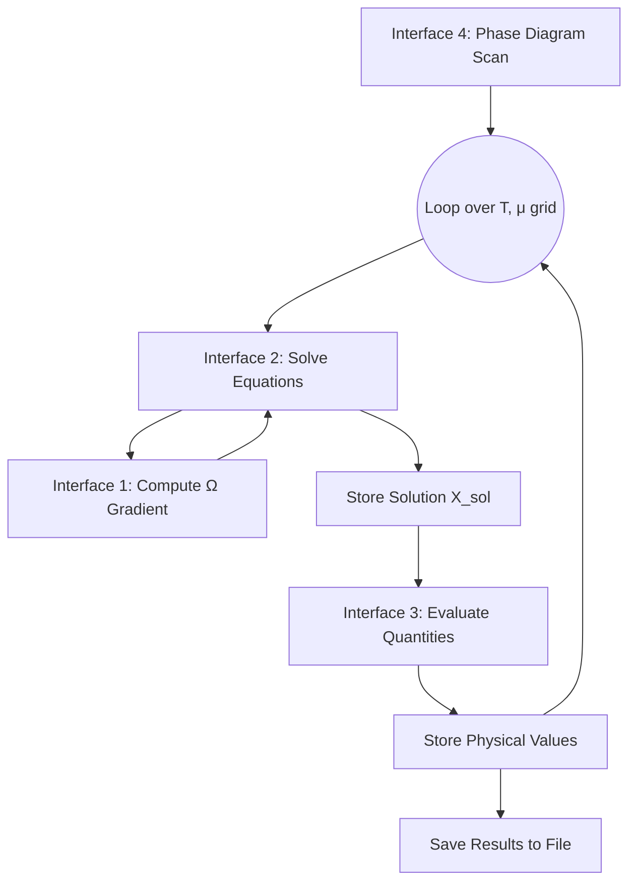

# 通用公共接口设计需求 - 用户实现想法

## 文档说明
此文件用于记录用户对通用公共接口设计的具体想法，包括架构、伪代码、输入输出参数、工具需求等。

---

## 需求1: 自动微分公共接口设计
**目标**: 将自动微分设计为公共接口，以便求解方程组——Omega对phi_u,phi_d,phi_s,Phi1,Phi2的偏导均为0

### 用户实现想法
公共接口要适度地抽象，根据目前的需求，自动微分仅需用于对Omega的求导，但Omega的具体形式会因模型而改变，如各向异性模型下会多一个xi参数，另外，在未来的需求中，Omega的求导对象(phi_u等)可能也会改变，因此额外参数和被求导参数应该要作为公共接口的输入参数
#### 架构设计
```
请在此处写入您的架构想法...
例如：
- 接口应该支持哪些物理模型？
A:支持需要实现巨热力学势Omega的模型
- 如何处理不同模型的变量数量差异？
A：可以将Omega函数的所有额外参数作为params传入，将被求导参数也合并后命名传入
- 是否需要支持自定义变量组合？
```


---

# 通用公共接口设计需求 - 实现方案 (基于PNJL模型背景)

## 文档说明
此文件用于记录基于PNJL模型（包括各向异性扩展）的通用公共接口设计的具体实现方案，包括架构、伪代码、输入输出参数、工具需求等。

---

## 需求1: 自动微分公共接口设计
**目标**: 将自动微分设计为公共接口，以便求解方程组——Omega对`phi_u, phi_d, phi_s, Phi, barPhi`的偏导均为0。需支持各向异性参数`ξ`等额外参数。
有时也需要用该接口求Omega对'T,mu'的偏导数

### 用户实现想法
接口核心是计算标量函数`Ω`关于一组变量`X`的梯度`∇Ω(X; params)`。`Ω`的具体形式（各向同性、各向异性、未来其他模型）通过一个通用的函数句柄来抽象。变量和参数通过命名元组或字典传递，确保灵活性。

#### 架构设计
-   **模型抽象**: 不硬编码特定模型，而是接受一个计算`Ω`的函数`f_Ω(X, params)`作为输入。
-   **变量处理**: 变量`X`是一个向量，但其每个元素对应哪个物理量（如`X[1] -> φ_u`, `X[2] -> φ_d` ...）由调用上下文定义。`params`是一个包含所有其他固定参数（如`T, μ, ξ, model_constants`）的容器。
-   **接口角色**: 本接口专注于计算给定点`X`的梯度`∇Ω`和（可选）Hessian矩阵`H(Ω)`。方程求解是下一个接口的任务。

#### 伪代码
```julia
# f_Ω: Function that computes the thermodynamic potential Ω.
#       Signature: (X::AbstractVector, params) -> Real
# X: Current state vector [ϕ_u, ϕ_d, ϕ_s, Φ, Φ̄]
# params: NamedTuple or Dictionary containing fixed parameters (T, μ_b, ξ, masses, couplings, ...)
function compute_Ω_gradient(f_Ω, X, params)
    # Use ForwardDiff to compute the gradient of f_Ω with respect to X,
    # keeping `params` constant.
    g = ForwardDiff.gradient(x -> f_Ω(x, params), X)
    return g
end

# Optional: Function to compute the Hessian Matrix
function compute_Ω_hessian(f_Ω, X, params)
    H = ForwardDiff.hessian(x -> f_Ω(x, params), X)
    return H
end
```

#### 输入参数规范
-   `f_Ω (Function)`: 计算巨热力学势Ω的函数。必须遵循接口`value = f_Ω(X, params)`。
-   `X (AbstractVector{Float64})`: 当前点的变量值向量，例如`[ϕ_u, ϕ_d, ϕ_s, Φ, Φ̄]`。
-   `params (NamedTuple或Dict)`: 包含所有其他常参数的容器。典型字段：
    -   `T`: 温度 (MeV)
    -   `μ_b` 或 `μ_u, μ_d, μ_s`: 重子化学势或夸克化学势 (MeV)
    -   `ξ`: 各向异性参数 (无单位)
    -   `m_u, m_d, m_s`: 流夸克质量 (MeV)
    -   `G, K`: 相互作用常数
    -   `Λ`: 动量截断 (MeV)
    -   `a0, a1, a2, b3, T0`: Polyakov Loop 势参数

#### 输出参数规范
-   `gradient (Vector{Float64})`: Ω在点`X`处的梯度向量 `[∂Ω/∂X₁, ∂Ω/∂X₂, ..., ∂Ω/∂Xₙ]`。
-   `hessian (Matrix{Float64})` (可选): Ω在点`X`处的Hessian矩阵。

#### 需要的工具和依赖
-   **Julia包**: `ForwardDiff.jl` (核心), `Printf.jl` (可能用于日志)
-   **特殊要求**: 函数`f_Ω`需要是使用Julia原生代码实现的，能被`ForwardDiff.jl`正确微分。

---

## 需求2: 方程求解器公共接口设计
**目标**: 使用`NLsolve`求解方程组 `F(X) = ∇Ω(X; params) = 0`，设计为公共接口。

### 用户实现想法
此接口封装非线性求解器。它接收一个计算残差（即梯度）的函数`F(X)`，一个初始猜测`X0`，以及求解器配置参数。它利用接口1中定义的`compute_Ω_gradient`（或一个等价的闭包）来构建`F(X)`。

#### 架构设计
-   **统一接口**: 求解器接口接收一个函数`F!`，其功能为`F!(out, X)`，计算残差`F(X)`并存入`out`。
-   **配置化**: 求解方法（如`:newton`）、容差、最大迭代次数等通过一个配置对象传递。
-   **错误处理**: 提供清晰的收敛状态信息（成功/失败），失败时记录残差和迭代次数。

#### 伪代码
```julia
# f_Ω: The function to compute Ω (as in Interface 1)
# params: The fixed parameters (as in Interface 1)
# X0: Initial guess for the variables [ϕ_u, ϕ_d, ϕ_s, Φ, Φ̄]
# solver_config: A NamedTuple specifying solver options (method, xtol, ftol, maxiter, ...)

function solve_equations(f_Ω, params, X0, solver_config)
    # Define the residual function F! for NLsolve, which is the gradient of Ω.
    # NLsolve expects F!(storage, X) 
    function F!(F_val, X)
        # Reuse the function from Interface 1 to compute the gradient at X
        g = compute_Ω_gradient(f_Ω, X, params)
        F_val .= g # Copy the gradient vector into the output storage F_val
        return F_val
    end

    # Call the NLsolve function with the configured options
    result = NLsolve.nlsolve(F!, X0, solver_config.method;
                            xtol=solver_config.xtol,
                            ftol=solver_config.ftol,
                            iterations=solver_config.maxiter,
                            # ... other options from solver_config
                            )

    # Check convergence and package results
    if NLsolve.converged(result)
        solution = result.zero
        converged = true
        residuals = result.residuals
        iters = result.iterations
        # ... any other relevant info
    else
        solution = result.zero # Best guess even if not converged
        converged = false
        # ... log error information, residuals, iters
        # Optionally throw an error or warning here depending on desired behavior
    end

    return (solution=solution, converged=converged, residuals=residuals, iterations=iters, result=result)
end
```

#### 输入参数规范
-   `f_Ω (Function)`: 同接口1。
-   `params (NamedTuple或Dict)`: 同接口1。
-   `X0 (AbstractVector{Float64})`: 求解变量的初始猜测值向量。
-   `solver_config (NamedTuple)`: 求解器配置。
    -   `method (Symbol)`: 求解算法，例如`:newton`, `:trust_region`。
    -   `xtol (Float64)`: 变量容差。
    -   `ftol (Float64)`: 函数值（残差）容差。
    -   `maxiter (Int)`: 最大迭代次数。
    -   `show_trace (Bool)`: 是否显示迭代轨迹。

#### 输出参数规范
-   `solution (Vector{Float64})`: 求解得到的变量值`X_sol`。
-   `converged (Bool)`: 是否收敛的标志。
-   `residuals (Vector{Float64})`: 求解完成时的残差向量 `F(X_sol)`。
-   `iterations (Int)`: 使用的迭代次数。
-   `result`: 原始求解器结果对象（用于高级诊断）。

#### 需要的工具和依赖
-   **Julia包**: `NLsolve.jl` (核心), `Logging.jl` (用于错误/警告信息)

---

## 需求3: 函数值计算公共接口设计
**目标**: 设计公共接口，输入方程的解`X_sol`和参数`params`，输出特定物理量的值（如压强`p = -Ω(X_sol, params)`，熵密度，涨落等）。

### 用户实现想法
这是一个分发函数（dispatch function）。它根据请求的`quantity_name`，调用相应的计算函数。计算函数接收`X_sol`和`params`，返回物理量。物理量的定义与模型`f_Ω`紧密相关。

#### 架构设计
-   **注册表模式**: 维护一个字典`quantity_calculators`，将物理量名称（符号如`:pressure`, `:chiral_cond_u`）映射到具体的计算函数。
-   **计算函数接口**: 每个计算函数必须遵循接口`value = calc_quantity(X, params)`。
-   **核心量计算**: 首先计算`Ω_value = f_Ω(X, params)`，因为许多物理量（如压强）衍生于此。

#### 伪代码
```julia
# Predefine a dictionary that maps quantity names to calculation functions
const quantity_calculators = Dict{Symbol, Function}()

# Register the basic calculator for pressure (p = -Ω)
quantity_calculators[:pressure] = (X, params) -> -f_Ω(X, params) 

# Register calculator for chiral condensate φ_u (it's just X[1])
quantity_calculators[:chiral_cond_u] = (X, params) -> X[1]
# ... register others for φ_d, φ_s, Φ, Φ̄

# Register calculator for entropy density (s = -∂Ω/∂T |_{V, μ})
# This requires a numerical derivative wrt T. We can use ForwardDiff again.
# Note: This is more expensive and requires careful handling of params.
function calc_entropy_density(X, params)
    # Create a closure for Ω at fixed X and all params except T
    omega_at_fixed_X(T_val) = f_Ω(X, merge(params, (T=T_val,)))
    # Compute derivative d(Ω)/dT at params.T
    dΩdT = ForwardDiff.derivative(omega_at_fixed_X, params.T)
    return -dΩdT
end
quantity_calculators[:entropy_density] = calc_entropy_density

# Main interface function
function evaluate_quantity(f_Ω, quantity_name, X, params)
    calculator_func = get(quantity_calculators, quantity_name, nothing)
    if calculator_func === nothing
        throw(ArgumentError("Quantity '$quantity_name' is not registered or available."))
    end
    value = calculator_func(X, params)
    return value
end

# Function to evaluate multiple quantities at once
function evaluate_quantities(f_Ω, quantity_names, X, params)
    results = Dict{Symbol, Float64}()
    for name in quantity_names
        results[name] = evaluate_quantity(f_Ω, name, X, params)
    end
    return results
end
```

#### 输入参数规范
-   `f_Ω (Function)`: 同接口1。
-   `quantity_name (Symbol或Vector{Symbol})`: 需要计算的物理量名称，例如`:pressure`, `:chiral_cond_u`, `:entropy_density`, `:kurtosis`。
-   `X (AbstractVector{Float64})`: 变量值向量（通常是方程的解`X_sol`）。
-   `params (NamedTuple或Dict)`: 同接口1。

#### 输出参数规范
-   `value (Float64或Dict{Symbol, Float64})`: 单个物理量的数值或一个包含多个物理量名称和值的字典。
-   （可选）单位信息可通过在注册表中存储元数据来实现。

#### 需要的工具和依赖
-   **Julia包**: `ForwardDiff.jl` (用于需要数值微分的量，如熵密度、涨落)
-   **特殊要求**: 需要预先为所有支持的物理量注册计算函数。

---

## 需求4: 相图扫描公共接口设计
**目标**: 设计公共接口，扫描相图(`T`, `μ_b`空间)，对每个点求解方程并计算指定物理量，最后输出数据。

### 用户实现想法
此接口协调前三个接口的工作。它在指定的`T`和`μ_b`网格上循环。对于每个点`(T_i, μ_b_j)`：
1.  设置参数`params`，包括当前的`T_i`, `μ_b_j`和固定的`ξ`, `masses`等。
2.  （可选）使用前一个点的解或智能猜测为`X0`提供初值，以加速收敛。
3.  调用接口2的`solve_equations`求解`X_sol`。
4.  调用接口3的`evaluate_quantities`计算所有需要的物理量。
5.  存储结果。
支持并行计算以提升性能。

#### 架构设计
-   **网格定义**: 由`T_range`和`μ_range`定义扫描范围。
-   **动态初始猜测**: 实现一个简单的策略，例如使用前一个`T`（或`μ`）的解作为当前点的初始猜测。
-   **并行化**: 使用`@distributed`循环或`pmap` over `μ_b`（通常点数较少）或内部网格点。
-   **数据管理**: 收集结果并在内存中构建数组，最后写入文件。同时记录收敛失败的点。
-   **可恢复性**: 定期将结果缓存到磁盘，允许从中断点重启扫描。

#### 伪代码
```julia
# f_Ω: The Ω function
# base_params: Base parameters (ξ, masses, G, K, Λ, a0...). WITHOUT T and μ_b.
# T_values: Vector of temperature values to scan (MeV)
# μb_values: Vector of baryon chemical potential values to scan (MeV)
# quantities_to_calc: Vector of Symbols specifying which quantities to compute
# output_filename: Path for the output file
# initial_guess: Initial guess for X at the first point (or a function to generate it)

function scan_phase_diagram(f_Ω, base_params, T_values, μb_values, quantities_to_calc, output_filename; initial_guess)
    # Preallocate arrays for results or create an empty list
    results = [] # This could be a more sophisticated structure

    # Strategy: Loop over μ_b first, as its variation might be more drastic.
    # Use a smart initial guess along T for fixed μ_b.
    for (j, μ_b) in enumerate(μb_values)
        # Initialize guess for this μ_b column. 
        # Could use the provided initial_guess for the first T, then use previous T's solution.
        X_guess_prev = initial_guess # For the first T at this μ_b

        for (i, T) in enumerate(T_values)
            current_params = merge(base_params, (T=T, μ_b=μ_b)) # Combine fixed and varying params
            println("Solving for T = $T MeV, μ_b = $μ_b MeV")

            # Solve the equations of motion
            sol_result = solve_equations(f_Ω, current_params, X_guess_prev, solver_config)
            X_sol = sol_result.solution

            if !sol_result.converged
                @warn "Convergence failed at (T=$T, μ_b=$μ_b). Using best guess."
                # Log this point and maybe try a fallback strategy?
            end

            # Calculate all requested physical quantities
            phys_values = evaluate_quantities(f_Ω, quantities_to_calc, X_sol, current_params)

            # Store the results: (T, μ_b), X_sol, all phys_values, convergence info
            result_point = (T=T, μ_b=μ_b, variables=X_sol, quantities=phys_values, converged=sol_result.converged)
            push!(results, result_point)

            # Update guess for next T point at this μ_b
            X_guess_prev = X_sol 
        end
    end

    # Convert results list into a convenient table (e.g., DataFrame)
    results_df = process_results_into_dataframe(results)

    # Save to file (CSV, JLD2, HDF5)
    save_results_to_file(results_df, output_filename)

    return results_df
end
```

#### 输入参数规范
-   `f_Ω (Function)`: 同接口1。
-   `base_params (NamedTuple)`: 包含所有*不随扫描变化*的参数的容器（`ξ, m_u, m_d, m_s, G, K, Λ, a0, a1, a2, b3, T0`）。
-   `T_values (Vector{Float64})`: 需要扫描的温度值向量 (MeV)。
-   `μb_values (Vector{Float64})`: 需要扫描的重子化学势值向量 (MeV)。
-   `quantities_to_calc (Vector{Symbol})`: 需要在每个点计算的物理量名称列表。
-   `output_filename (String)`: 输出文件路径。
-   `initial_guess (Vector{Float64})`: 扫描起点（如`(T_values[1], μb_values[1]`）的变量初始猜测值。
-   `solver_config`: 同接口2的求解器配置。

#### 输出参数规范
-   `results_df (DataFrame)`: 包含所有扫描结果的表格。每一行对应一个`(T, μ_b)`点，包含列：
    -   `T`, `μ_b`
    -   `ϕ_u`, `ϕ_d`, `ϕ_s`, `Φ`, `Φ̄` (变量)
    -   `pressure`, `entropy_density`, ... (请求的物理量)
    -   `converged` (布尔标志)
-   （可选）一个包含原始求解详细信息的独立日志。

#### 需要的工具和依赖
-   **Julia包**: `DataFrames.jl` (组织结果), `CSV.jl` 或 `JLD2.jl` 或 `HDF5.jl` (输出文件), `Distributed.jl` 或 `ThreadsX.jl` (并行化)
-   **特殊要求**: 需要仔细设计并行策略以避免重复工作或内存问题。需要实现结果缓存/检查点功能以支持长时间扫描。

---

## 整体架构集成想法

### 接口之间的调用关系

**流程**: 接口4驱动整个流程。它对每个`(T, μ)`点调用接口2。接口2为了计算残差（梯度），调用接口1。获得解`X_sol`后，接口4调用接口3来计算所有感兴趣的物理量。最终所有结果被收集并保存。

### 统一的模型抽象
-   **核心模型函数**: 所有接口都围绕一个统一的、符合签名的`f_Ω(X, params)`函数构建。要支持新模型（如各向同性PNJL、各向异性PNJL、PQM），只需提供不同的`f_Ω`实现。
-   **参数传递**: 所有固定和变化的参数都通过一个`params`容器传递，确保一致性。
-   **物理量注册**: 接口3的物理量计算器注册表允许灵活地添加新模型特有的物理量，而无需修改核心接口。

### 性能和优化考虑
-   **自动微分**: `ForwardDiff.jl`通常非常高效。确保`f_Ω`的实现本身是优化的。
-   **求解器热启动**: 接口4中使用前一个解作为初始猜测可以显著减少接口2所需的迭代次数。
-   **并行扫描**: 接口4的扫描可以很容易地按`μ_b`值进行并行化，因为每个`μ_b`列的计算相对独立。
-   **内存**: 对于大型扫描，避免在内存中存储所有原始数据直到最后。考虑增量式写入文件。

### 错误处理和健壮性
-   **求解失败**: 接口2返回收敛状态。接口4应记录失败点，并可能尝试使用不同的初始猜测或求解器设置进行恢复。
-   **输入验证**: 每个接口都应验证输入尺寸和关键参数的有效性（如`T > 0`）。
-   **日志记录**: 使用Julia的`Logging`模块来记录信息、警告和错误，而不是简单地将内容打印到`stdout`。

---

## 实现优先级和时间规划

### 第一阶段 (高优先级)
1.  **接口1 (`compute_Ω_gradient`)**: 核心功能，相对简单独立。
2.  **一个正确的`f_Ω`实现**: 用于各向同性和各向异性PNJL模型。这是所有计算的基础。
3.  **接口3的基础部分**: 实现和注册核心物理量（`pressure`, `chiral_cond_*`, `Polyakov_loop`）。
4.  **接口2 (`solve_equations`)**: 包装`NLsolve`，处理简单的初始猜测。

### 第二阶段 (中优先级)
1.  **接口4 (`scan_phase_diagram`)**: 实现串行版本，包含简单的初始猜测传播（沿T方向）。
2.  **扩展接口3**: 添加需要数值微分的物理量，如熵密度 (`s`)、热容量、 baryon number susceptibility (`χ_B` - 与涨落相关）。
3.  **测试和验证**: 针对已知结果（如`μ=0`时的晶格数据或已发表论文中的相图）测试整个流程。

### 第三阶段 (低优先级/未来扩展)
1.  **接口4的并行化**: 使用`Distributed.jl`实现。
2.  **更先进的初始猜测策略**: 例如基于粗网格扫描的插值。
3.  **接口4的检查点/重启功能**。
4.  **支持更多模型**: 实现PQM、其他有效模型等的`f_Ω`函数。
5.  **高级分析和可视化工具**: 自动定位CEP、绘制相图、等值线等。
6.  **用户友好的高级包装器**: 简化常见任务（“为我绘制这个模型的相图”）。

---

## 测试和验证策略

### 单元测试
-   **接口1**: 对简单的解析函数进行测试，将其梯度与已知解析导数进行比较。
-   **接口2**: 测试已知解的小型非线性系统。
-   **接口3**: 针对固定`X`和`params`，测试单个物理量计算器的输出是否符合预期（例如，通过手动计算或不同方法）。
-   **`f_Ω`函数**: 在特定点（如`T=0`, `μ=0`）测试其值和对某些参数的导数。

### 集成测试
-   **`μ=0`的交叉检验**: 在`μ_b=0`时运行扫描，将得到的`T_χ`和`T_D`与已知的晶格QCD结果或已发表的有效模型结果进行比较。
-   **守恒检查**: 验证热力学关系，例如通过接口3计算的熵密度是否等于`∂(p)/∂T |_μ`（通过数值微分压强得到）。
-   **各向异性极限**: 设置`ξ=0`，验证各向异性模型的结果是否退化到各向同性情况。

### 性能基准测试
-   **单点求解时间**: 测量在不同`(T, μ)`点求解方程所需的时间。
-   **扫描缩放**: 测量扫描不同大小网格所需的总时间，并评估并行效率。

---

## 文档和用户指南

### API文档需求
-   所有四个公共接口的详细docstring，包含示例。
-   `f_Ω`函数必须遵循的签名和要求的明确说明。
-   `params` `NamedTuple`中预期参数的列表。
-   接口3中注册的所有物理量列表及其定义。

### 教程和示例
-   **示例1**: 如何为各向同性PNJL模型定义`f_Ω`和`params`。
-   **示例2**: 如何在单一点`(T, μ)`求解方程并计算压强。
-   **示例3**: 如何执行简单的`T`扫描（固定`μ`）并绘制`φ_u(T)`。
-   **示例4**: 如何执行完整的`(T, μ_b)`扫描并生成相图（临界线）、等熵线以及`χ_B`图。

---

## 备注和其他想法
-   **灵敏度分析**: 该框架非常适合进行灵敏度分析（例如，模型参数如`K`、`ξ`如何影响CEP位置）。
-   **机器学习集成**: 训练神经网络来近似`X_sol(T, μ, ξ, ...)`或甚至`Ω`本身，作为昂贵的数值求解的代理模型，这可能是一个有趣的高级方向。
-   **参数数据库**: 考虑为不同的已发布模型参数集（如Table I中的参数）创建一个小的注册表或数据库。